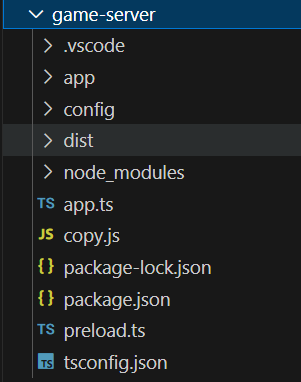

# pinus 学习（一）项目结构与项目启动介绍
项目结构介绍，项目入口，服务器启动流程介绍

## 目录结构

创建一个helloworld示例工程，会创建两个服务器，一个game-server一个web-server，game-server是游戏服务器，目录结构如下



* 目录app中存放项目代码
* 目录config中存放服务器配置
* 目录dist是编译后生成的目录
* 目录node_modules是第三方库包
* 文件app.ts是服务器入口
* 文件copy.js 功能是将配置文件拷贝到dist目录
* 文件preload.ts实现捕获错误
* 文件package.js与package-lock.json 是npm包管理配置文件 （依赖的第三方库和自定义脚本）
* 文件tsconfig.json 是 typescript项目的配置文件（编译的配置与需要编译的文件）

## 项目启动

在game-server目录中执行`npm i`安装第三方依赖，然后运行`tsc`，编译TS代码，编译结果将输出到dist文件夹中，然后运行`node cooy` 拷贝配置文件到dist目录中，再在dist目录中执行`node app` ,服务器就启动了。

## 项目结构


### app.ts

这个文件是入口，创建项目后默认的代码如下

```ts
import { pinus } from 'pinus';
import { preload } from './preload';

/**
 *  替换全局Promise
 *  自动解析sourcemap
 *  捕获全局错误
 */
preload();

/**
 * Init app for client.
 */
let app = pinus.createApp();
app.set('name', 'helloworld');

// app configuration
app.configure('production|development', 'connector', function () {
    app.set('connectorConfig',
        {
            connector: pinus.connectors.hybridconnector,
            heartbeat: 3,
            useDict: true,
            useProtobuf: true
        });
});

// start app
app.start();
```

