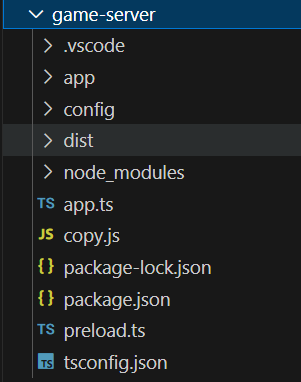

# pinus 学习（一）项目结构与源码分析启动
项目结构介绍，项目入口，服务器启动流程介绍

## 目录结构

创建一个helloworld示例工程，会创建两个服务器，一个game-server一个web-server，game-server是游戏服务器，目录结构如下



* 目录app中存放项目代码
* 目录config中存放服务器配置
* 目录dist是编译后生成的目录
* 目录node_modules是第三方库包
* 文件app.ts是服务器入口
* 文件copy.js 功能是将配置文件拷贝到dist目录
* 文件preload.ts实现捕获错误
* 文件package.js与package-lock.json 是npm包管理配置文件 （依赖的第三方库和自定义脚本）
* 文件tsconfig.json 是 typescript项目的配置文件（编译的配置与需要编译的文件）

## 项目结构

创建的helloworld的示例工程的game-server中启动了两个服务器，master服务器和connector服务器

服务器中通过添加组件(component)来增加功能

### master服务器

#### MasterComponent

监控功能，启动了其他服务器

#### MonitorComponent

监控功能

### connector服务器

#### ProxyComponent

rpc 中 的client，调用其他服务器的函数

#### RemoteComponent

rpc 中 的server，服务与其他服务器，接收其他服务器的调用

#### ConnectionComponent

前台服务器才有，管理连接上的用户信息与用户数量

#### ConnectorComponent

前台服务器才有，管理用户连接，发送与接受消息，（根据配置会决定是否启动**DictionaryComponent**和**ProtobufComponent**）

#### SessionComponent

前台服务器才有，管理sessionID与socket的对应关系，sessionID在connectorComponent中设置

#### PushSchedulerComponent

前台服务器才有，推送消息

#### BackendSessionComponent

绑定后台服务器sessionID与（用户和前台服务器）的关系，连接绑定前台服务器与后台服务器的用户

#### ChannelComponent

将几个用户串成一组，可以群发消息

#### ServerComponent

服务器功能，其中有Filter（过滤器），Handler（处理某条客户端消息），Crons（一些定时任务）

#### MonitorComponent

监控功能

## 项目启动

在game-server目录中执行`npm i`安装第三方依赖，然后运行`tsc`，编译TS代码，编译结果将输出到dist文件夹中，然后运行`node cooy` 拷贝配置文件到dist目录中，再在dist目录中执行`node app` ,服务器就启动了。

## 源码分析

### app.ts

这个文件是入口，创建项目后默认的代码如下

```ts
import { pinus } from 'pinus';
import { preload } from './preload';

/**
 *  替换全局Promise
 *  自动解析sourcemap
 *  捕获全局错误
 */
preload();

/**
 * Init app for client.
 */
let app = pinus.createApp();
app.set('name', 'helloworld');

// app configuration
app.configure('production|development', 'connector', function () {
    app.set('connectorConfig',
        {
            connector: pinus.connectors.hybridconnector,
            heartbeat: 3,
            useDict: true,
            useProtobuf: true
        });
});

// start app
app.start();
```

这里会启动Master服务器，app.configure的第二个参数说明，这个配置是connector服务器的配置，master在这里不会执行， app.start（）中会加载Master服务器的两个默认Component，并初始化，然后再根据配置文件servers.json去启动connector服务器

先来看下app.ts里面的内容

`let app = pinus.createApp();` 这里创建了Application类，在createApp中调用了init，然后使用`app.configure()` 来给每个服务器设置配置，添加自定义组件，最后`app.start()` 启动服务器

### pinus.createApp()

创建一个application，其中init函数如下：

```ts
init(opts ?: ApplicationOptions) {
        opts = opts || {};
        let base = opts.base || path.dirname(require.main.filename);
        this.set(Constants.RESERVED.BASE, base);
        this.base = base;	//设置项目根目录

        appUtil.defaultConfiguration(this);

        this.state = STATE_INITED;
        logger.info('application inited: %j', this.getServerId());
    }
    
appUtil.ts
export function defaultConfiguration(app: Application) {
    let args = parseArgs(process.argv);//解析运行命令参数
    setupEnv(app, args);				//设置当前环境（Development或是Production）
    loadMaster(app);					//从config目录中读取master.json配置记录
    loadServers(app);					//从config目录中读取servers.json配置记录
    processArgs(app, args);				//解析命令行参数，这里面只有master服务器可以从命令行中获取参数，其他服务器都会从配置文件中获取参数
    configLogger(app);					//配置日志
    loadLifecycle(app);					//helloworld示例工程中没有，根据后面的代码，猜测是插件的加载（插件在后面介绍，大概是一系列功能的集合）
}
```

### app.configure()

根据传入的env和type来决定是否要执行fn里的内容，helloworld示例工程中的这个函数，只有connector服务器需要执行

```ts
configure(fn: ConfigureCallback): Application;
    configure(env: string, fn: ConfigureCallback): Application;
    configure(env: string, type: string, fn: ConfigureCallback): Application;
    configure(env: string | ConfigureCallback, type ?: string | ConfigureCallback, fn ?: ConfigureCallback): Application {
        let args = [].slice.call(arguments);
        fn = args.pop();
        env = type = Constants.RESERVED.ALL;

        if (args.length > 0) {
            env = args[0];
        }
        if (args.length > 1) {
            type = args[1];
        }

        if (env === Constants.RESERVED.ALL || contains(this.settings.env, env as string)) {
            if (type === Constants.RESERVED.ALL || contains(this.settings.serverType, type as string)) {
                fn.call(this);
            }
        }
        return this;
    }
```

### app.start()

读取完配置后，这里正式启动服务器

```ts
start(cb ?: (err ?: Error, result ?: void) => void) {
        this.startTime = Date.now();
        if (this.state > STATE_INITED) {
            utils.invokeCallback(cb, new Error('application has already start.'));
            return;
        }

        let self = this;
        appUtil.startByType(self, function () {
            appUtil.loadDefaultComponents(self);
            let startUp = function () {
                self.state = STATE_BEFORE_START;
                logger.info('%j enter before start...', self.getServerId());

                appUtil.optComponents(self.loaded, Constants.RESERVED.BEFORE_START, function (err) {
                    if (err) {
                        utils.invokeCallback(cb, err);
                    } else {
                        logger.info('%j enter start...', self.getServerId());

                        appUtil.optComponents(self.loaded, Constants.RESERVED.START, function (err) {
                            self.state = STATE_START;
                            if (err) {
                                utils.invokeCallback(cb, err);
                            } else {
                                logger.info('%j enter after start...', self.getServerId());
                                self.afterStart(cb);
                            }
                        });
                    }
                });

            };

            appUtil.optLifecycles(self.usedPlugins, Constants.LIFECYCLE.BEFORE_STARTUP, self, function (err) {
                if (err) {
                    utils.invokeCallback(cb, err);
                } else {
                    startUp();
                }
            });
        });
    }
```

appUtil.startByType，这个函数可以根据配置决定是否通过master服务器来启动其他服务器，如果不通过master服务器启动，会直接在这里启动服务，start（）后面的逻辑也不会执行了，

如果通过Master服务器启动，会执行回调函数，回调函数中`appUtil.loadDefaultComponents(self);` 加载了默认的组件，项目结构中介绍了的组件全部是默认组件，connector服务器的组件就是非master服务器的默认组件。

加载默认组件会直接创建出来，调用构造函数。

下面通过`appUtil.optLifecycles`  执行每个插件的beforeStartup，然后再通过`appUtil.optComponents` 执行每个组件的beforeStart与start，然后执行 `self.afterStart(cb);`，afterStart里面将执行每个组件的afterStart和每个插件的afterStartup

最后发送start_server信号，一个服务器就启动了

>组件和插件中的afterStartAll，将会再所有服务器启动后执行，这是单个服务器启动的逻辑，所以没有调用


